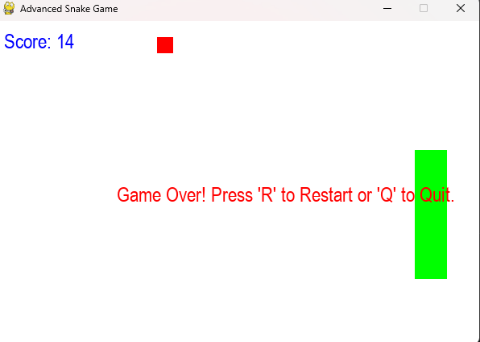

# Snake Game

This project is a classic Snake Game implemented using Python and Pygame. Navigate the snake to eat food, grow longer, and avoid collisions with the walls or itself.

# Game Screenshot


## Features

- **Classic Gameplay**: Control the snake to eat food and grow longer.
- **Score Tracking**: Keep track of your score as the snake eats more food.
- **Game Over Handling**: Restart the game or quit when the game is over.
- **Simple Controls**: Use arrow keys to control the snake's direction.

## Requirements

- Python 3.x
- `pygame` library

## Installation

1. Clone the repository:
   ```bash
   git clone https://github.com/sifat-8208/PySnakeGame.git
   ```
2. Navigate to the project directory:
   ```bash
   cd SnakeGame
   ```
3. Install the required library:
   ```bash
   pip install pygame
   ```

## Usage

1. Run the game script:
   ```bash
   python snake_game.py
   ```
2. Use the arrow keys to control the snake.
3. Press 'R' to restart the game or 'Q' to quit when the game is over.

## License

This project is licensed under the [MIT License](https://opensource.org/licenses/MIT). You are free to use, modify, and distribute this project.

## Disclaimer

This game is intended for educational and entertainment purposes. Enjoy playing the Snake Game and feel free to contribute or modify the code as you wish!